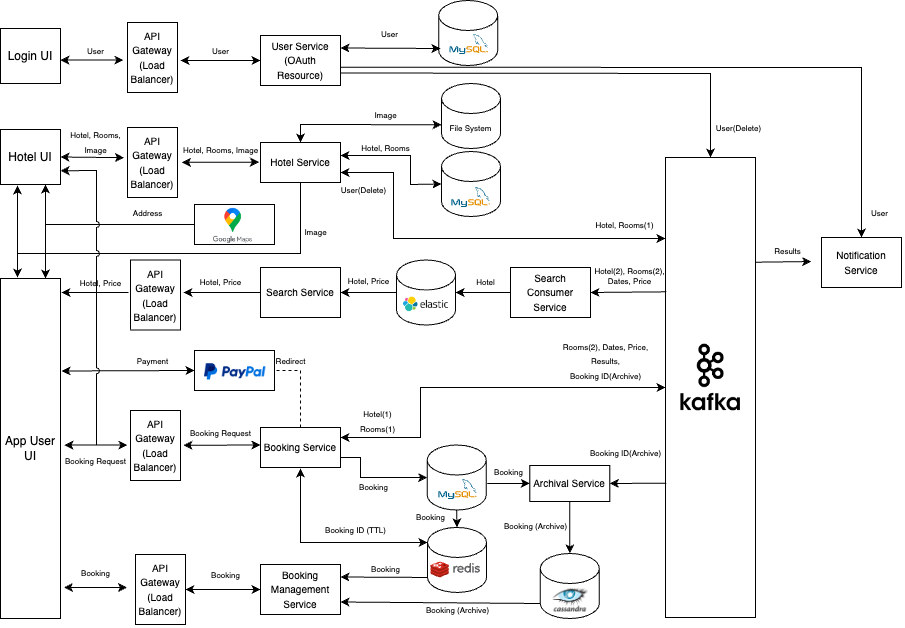

# Hotel Booking System

## Features

### For app users
- Search hotels with various options
  - location (city, state, country)
  - dates (up to 90 days)
  - number of adults, children, beds, and rooms
  - price range
  - hotel features (property type, property rating, facilities)
  - room facilities
- Room recommendations: optimized based on number of adults, children, beds, and rooms
- Map service for hotel locations (Google Maps API)
- Reserve rooms with given no prepayment days and free cancellation days
- Payment with PayPal
- Save hotels for later consideration
- Booking records by status and dates

### For hotel managers
- Hotel/rooms registration and modification with address recommendations (Google Places API) and image uploads.
- Hotel summary page for hotel information, reservation, and booking history
- Manage available and reservation dates for each room through a timeline calendar
- Booking records by status and dates

## Technologies
- Backend framework: Spring
- Database and message queue: MySQL, Cassandra, ElasticSearch, Redis, Kafka
- Security: JSON Web Tokens, OAuth 2.0
- External API: Google Maps API, Paypal
- Compile and deployment: Maven, Docker, Kubernetes
- Frontend: React, HTML, CSS

## System

<p align="center">
  
</p>

1. apigw: Spring Cloud API Gateway to route and load-balance requests 
2. eureka-server: Spring Eureka Server
3. zipkin: a distributed tracing system
4. user: User service, OAuth 2.0 Resource Server
5. hotel: Hotel/Room registration service
6. booking: a service that processes booking
7. booking-management: a service used to fetch booking records
8. archival: archive completed booking records
9. search-consumer: populate and update ElasticSearch documents
10. search: generate and execute ElasticSearch queries
11. notification: aggregate notification message and user information for email notification (disabled)

For system design specifications, please refer to the [design documentation](https://github.com/dlim2012/hotel-booking-system/blob/main/Design%20doc.pdf).

## Frontend

Screenshots:
[home](https://github.com/dlim2012/hotel-booking-system/blob/main/_images/screenshots/home.png), 
[search](https://github.com/dlim2012/hotel-booking-system/blob/main/_images/screenshots/search.png),
[hotel](https://github.com/dlim2012/hotel-booking-system/blob/main/_images/screenshots/hotel.png), 
[dates](https://github.com/dlim2012/hotel-booking-system/blob/main/_images/screenshots/dates.png)

## To build run this project

### Configurations
1. Set base image url address (custom.file.imageUrlPrefix) in "hotel/src/main/resources/application-${profile}.yaml".
2. Set backend ingress address (custom.paypal.host) and frontend address (custom.paypal.frontend) in "booking/src/main/resources/application-${profile}.yaml" for redirections.

### 1) Run services manually

```
# 1. Modify database urls for each service in "${service-name}/src/main/resources/application-default.yaml".

# 2. Compile java files.
mvn compile

# 3. Run all databases and Zipkin.
# docker compose up -f docker-compose-db.yaml -d

# 4. Run all services.
cd ${service-name}
SPRING_PROFILES_ACTIVE=default java -jar target/${service-name}-0.0.1-SNAPSHOT.jar
```
### 2) Run using Docker
```
# 1. Compile java files.
mvn compile

# 2. Compile Docker images with new image names in "docker-compose.yml".
docker compose build 

# 3. Run Docker files.
docker compose up -d 

# 4. Wait until a superuser for Cassandra is created (a few minutes).
# Cassandra logs: docker logs -f hb-cassandra 

# 5. Create Cassandra keyspace and tables.
sh scripts/init.sh
```

### 3) Deploy using Kubernetes
```
# 1. Compile java files.
mvn compile

# 2. Compile Docker images with new image names in "docker-compose.yml".
docker compose build 
docker push ${repository-name}/${image}

# 3. Change "k8s/minikube/services" to used the new images.

# 4. Start Kubernetes.
minikube start

# 5. Create and run all databases: Cassandra, ElasticSearch, Kafka, MySQL(x3), Redis.
cd k8s/minikube
sh bootstrap.sh

# 6. Wait until a superuser for Cassandra is created (a few minutes).
# Cassandra logs: kubectl logs -f hb-cassandra-0

# 7. Create Cassandra keyspace and table.
sh bootstrap/cassandra/init.sh

# 8. Run all services.
sh service.sh

# 9. Run ingress with Kong ingress controller.
sh ingress.sh
```
