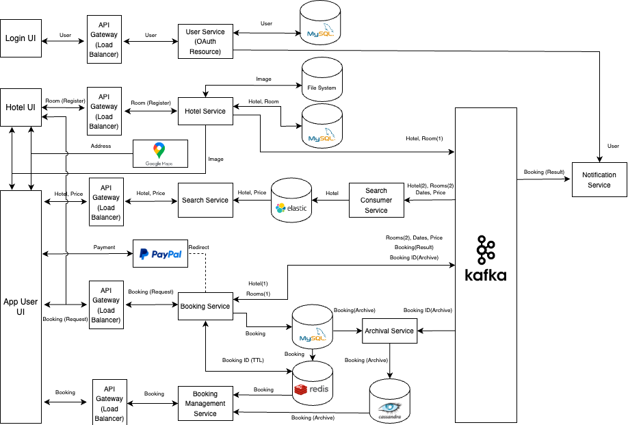
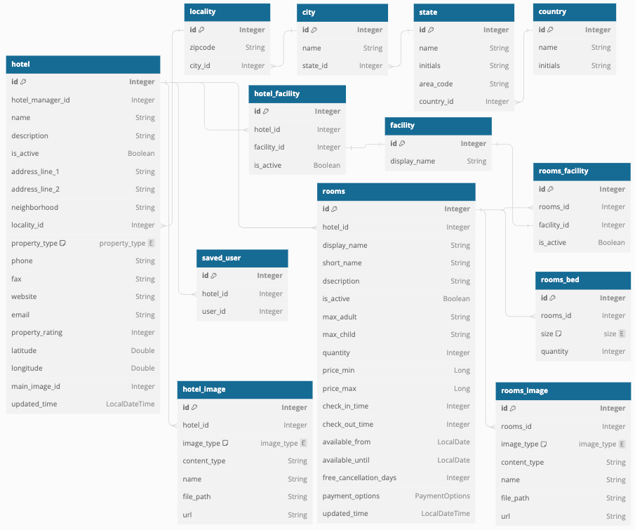
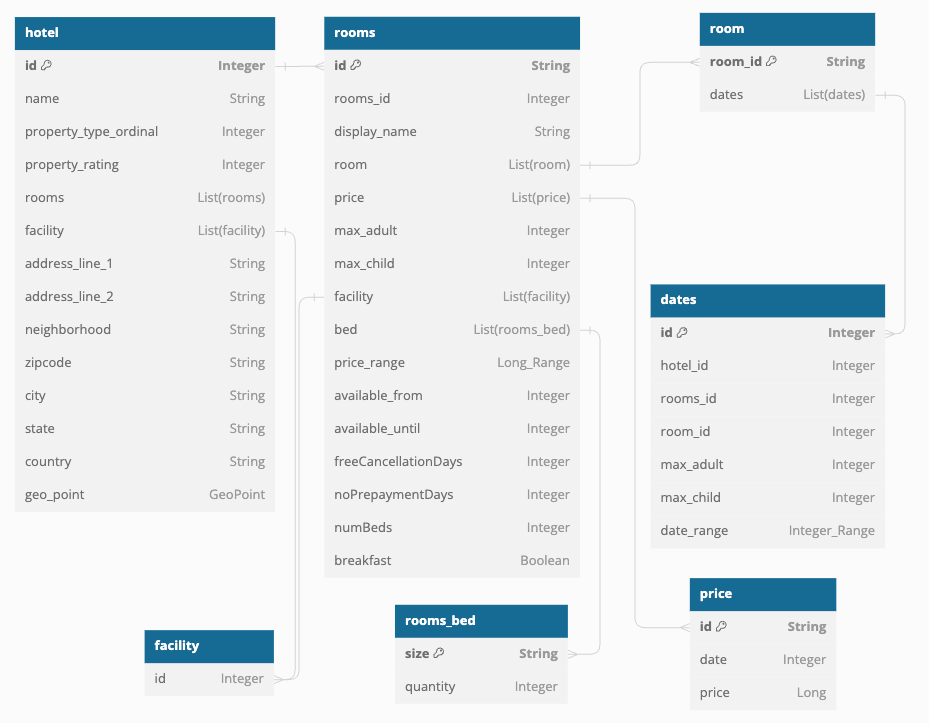
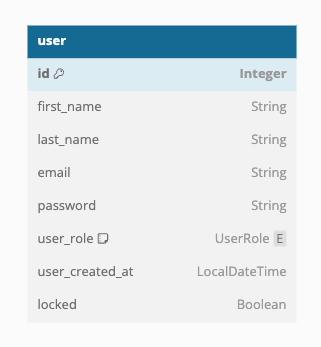
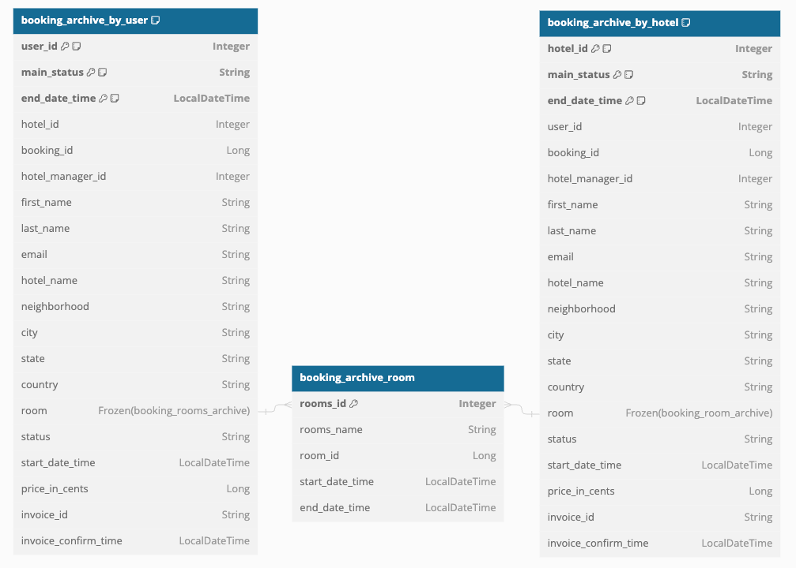
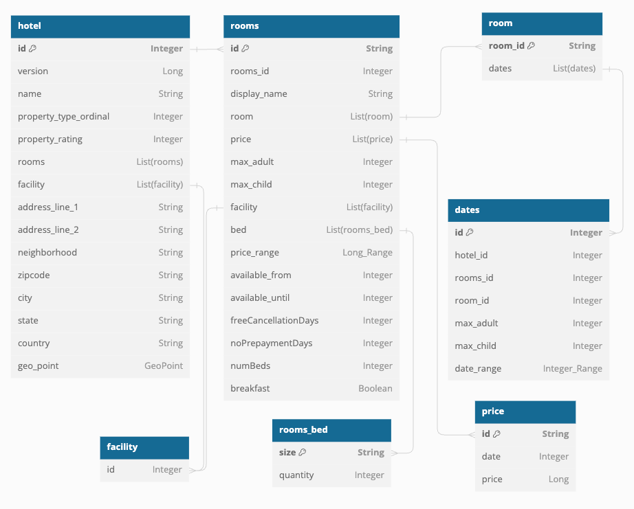

# Hotel Booking System

## System Design

  

## Databases

### Hotel Main - MySQL

  

### Booking - MySQL

  

### User - MySQL &nbsp;&nbsp;&nbsp;&nbsp;&nbsp;&nbsp;&nbsp;&nbsp;&nbsp;&nbsp;&nbsp;&nbsp;&nbsp;&nbsp;&nbsp;&nbsp;&nbsp;&nbsp;&nbsp;&nbsp;&nbsp;&nbsp;&nbsp;&nbsp;&nbsp;&nbsp;&nbsp;&nbsp; Booking Archive - Cassandra 

  
  

### ElasticSearch

  

